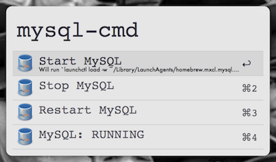

Alfred Nginx & MySQL & PHP-fpm
================================

Alfred 2 workflow to Toggle Localhost Services (Start, Stop, Restart and Check Status).

Based on my Localhost Enviroment [Installation](http://blog.frd.mn/install-nginx-php-fpm-mysql-and-phpmyadmin-on-os-x-mavericks-using-homebrew) (Thanks [frdmn](http://blog.frd.mn)!!).

> **Commands Included:** `localhost`, `nginx-cmd [start|stop|restart|status]`, `php-fpm-cmd [start|stop|restart|status]`, `mysql-cmd [start|stop|restart|status]`, `memcached-cmd [start|stop|restart|status]`.

## Installing
1. Click the download buttons below
2. Double-click to import into Alfred 2
3. Review the workflow to add custom Hotkeys
4. Edit /etc/sudoers to allow sudo to work without entering the password.

### Edit sudoers

1. `sudo visudo`
2. Add: 
	`Cmnd_Alias      NGINXSTART = /bin/launchctl load /Library/LaunchAgents/homebrew.mxcl.nginx.plist` 
	`Cmnd_Alias      NGINXSTOP = /bin/launchctl unload /Library/LaunchAgents/homebrew.mxcl.nginx.plist`  
	`username  ALL = NOPASSWD: NGINXSTART, NGINXSTOP`  

* * *

#### Localhost
  

#### Nginx
  

#### MySQL
  

#### PHP-fpm
  

#### Memcached
  
